# 15 Insights from South Dakota School Enrollment Data

``` r
library(sdschooldata)
library(dplyr)
library(tidyr)
library(ggplot2)

theme_set(theme_minimal(base_size = 14))
```

This vignette explores South Dakota’s public school enrollment data,
surfacing key trends and demographic patterns across 20 years of data
(2006-2025).

------------------------------------------------------------------------

## 1. South Dakota enrollment peaked in 2022 and is now declining

South Dakota’s public school enrollment grew steadily from 2015 to 2022,
peaking at 141,429, but has dropped 1.8% since then – losing 2,568
students in three years.

``` r
enr <- fetch_enr_multi(c(2015:2020, 2022:2025), use_cache = TRUE)

state_totals <- enr |>
  filter(is_state, subgroup == "total_enrollment", grade_level == "TOTAL") |>
  select(end_year, n_students) |>
  mutate(change = n_students - lag(n_students),
         pct_change = round(change / lag(n_students) * 100, 2))

stopifnot(nrow(state_totals) > 0)
state_totals
#>    end_year n_students change pct_change
#> 1      2015     134054     NA         NA
#> 2      2016     135811   1757       1.31
#> 3      2017     137251   1440       1.06
#> 4      2018     138428   1177       0.86
#> 5      2019     139442   1014       0.73
#> 6      2020     139154   -288      -0.21
#> 7      2022     141429   2275       1.63
#> 8      2023     141005   -424      -0.30
#> 9      2024     140587   -418      -0.30
#> 10     2025     138861  -1726      -1.23
```

``` r
ggplot(state_totals, aes(x = end_year, y = n_students)) +
  geom_vline(xintercept = 2020, linetype = "dashed", color = "gray50", alpha = 0.7) +
  annotate("text", x = 2020, y = max(state_totals$n_students), label = "COVID", hjust = -0.2, color = "gray50", size = 3) +
  geom_line(linewidth = 1.2, color = "#003087") +
  geom_point(size = 3, color = "#003087") +
  scale_y_continuous(labels = scales::comma) +
  scale_x_continuous(breaks = seq(2015, 2025, 2)) +
  labs(
    title = "South Dakota Public School Enrollment (2015-2025)",
    subtitle = "Peaked in 2022 at 141,429; now declining",
    x = "School Year (ending)",
    y = "Total Enrollment"
  )
```

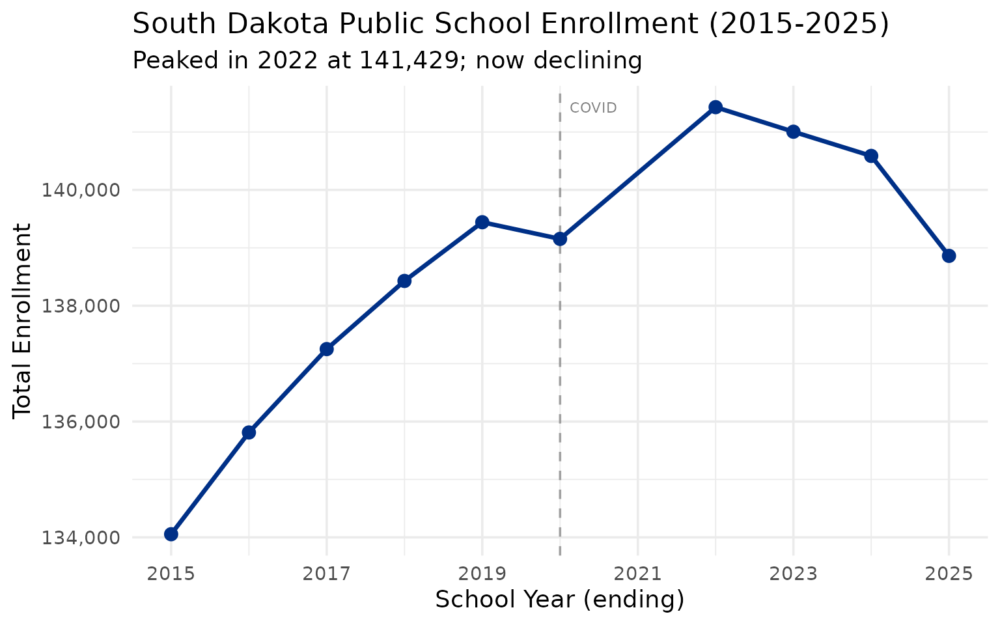

------------------------------------------------------------------------

## 2. Sioux Falls dominates the state

The Sioux Falls School District is by far the largest in the state, with
more students than the next several districts combined. Rapid City is a
distant second.

``` r
enr_2025 <- fetch_enr(2025, use_cache = TRUE)

top_10 <- enr_2025 |>
  filter(is_district, subgroup == "total_enrollment", grade_level == "TOTAL") |>
  arrange(desc(n_students)) |>
  head(10) |>
  select(district_name, n_students)

stopifnot(nrow(top_10) > 0)
top_10
#>           district_name n_students
#> 1      Sioux Falls 49-5      24841
#> 2  Rapid City Area 51-4      12040
#> 3       Harrisburg 41-2       6398
#> 4   Brandon Valley 49-2       5206
#> 5         Aberdeen 06-1       4134
#> 6        Brookings 05-1       3483
#> 7        Watertown 14-4       3425
#> 8            Huron 02-2       3042
#> 9          Yankton 63-3       2973
#> 10           Meade 46-1       2957
```

``` r
top_10 |>
  mutate(district_name = forcats::fct_reorder(district_name, n_students)) |>
  ggplot(aes(x = n_students, y = district_name)) +
  geom_col(fill = "#003087") +
  scale_x_continuous(labels = scales::comma) +
  labs(
    title = "South Dakota's 10 Largest School Districts (2025)",
    x = "Total Enrollment",
    y = NULL
  )
```

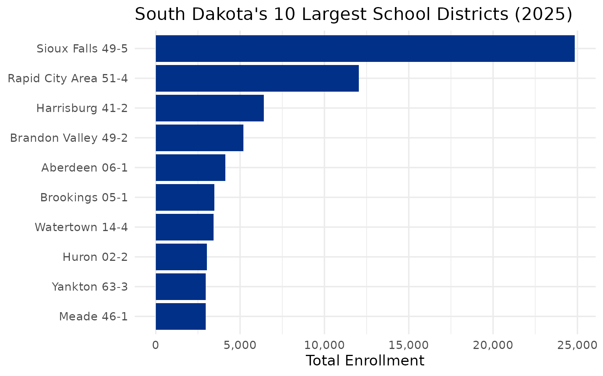

------------------------------------------------------------------------

## 3. Native American students are a significant population

South Dakota has one of the highest percentages of Native American
students in the nation, reflecting the state’s large reservation lands
including Pine Ridge, Rosebud, and Standing Rock. Demographic data is
reported at the campus level; here we aggregate across all campuses
statewide.

``` r
state_total <- enr_2025 |>
  filter(is_state, subgroup == "total_enrollment", grade_level == "TOTAL") |>
  pull(n_students)

demographics <- enr_2025 |>
  filter(is_campus, grade_level == "TOTAL",
         subgroup %in% c("white", "native_american", "hispanic", "black", "asian", "multiracial")) |>
  group_by(subgroup) |>
  summarize(n_students = sum(n_students, na.rm = TRUE), .groups = "drop") |>
  mutate(pct = round(n_students / state_total * 100, 1)) |>
  arrange(desc(n_students))

stopifnot(nrow(demographics) > 0)
demographics
#> # A tibble: 6 × 3
#>   subgroup        n_students   pct
#>   <chr>                <dbl> <dbl>
#> 1 white                95447  68.7
#> 2 native_american      14283  10.3
#> 3 hispanic             12845   9.3
#> 4 multiracial           8681   6.3
#> 5 black                 5051   3.6
#> 6 asian                 2308   1.7
```

``` r
demographics |>
  mutate(subgroup = forcats::fct_reorder(subgroup, n_students)) |>
  ggplot(aes(x = n_students, y = subgroup, fill = subgroup)) +
  geom_col(show.legend = FALSE) +
  geom_text(aes(label = paste0(pct, "%")), hjust = -0.1) +
  scale_x_continuous(labels = scales::comma, expand = expansion(mult = c(0, 0.15))) +
  scale_fill_brewer(palette = "Set2") +
  labs(
    title = "South Dakota Student Demographics (2025)",
    subtitle = "Aggregated from campus-level enrollment reports",
    x = "Number of Students",
    y = NULL
  )
```

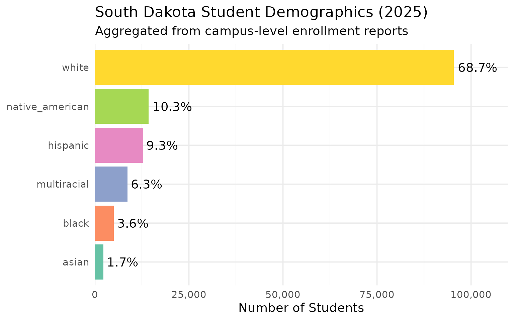

------------------------------------------------------------------------

## 4. Sioux Falls grows while Rapid City and rural hubs decline

The state’s largest district continues to grow, but Rapid City lost 12%
of its enrollment since 2015 and other regional hubs are shrinking.
District names vary across years in SD data, so we use district_id to
track districts consistently.

``` r
urban_growth <- enr |>
  filter(is_district, subgroup == "total_enrollment", grade_level == "TOTAL",
         grepl("Sioux Falls|Rapid City|Aberdeen|Brookings|Watertown", district_name)) |>
  group_by(district_id) |>
  arrange(end_year) |>
  summarize(
    district_name = last(district_name),
    y2015 = n_students[end_year == min(end_year)],
    y2025 = n_students[end_year == max(end_year)],
    pct_change = round((y2025 / y2015 - 1) * 100, 1),
    .groups = "drop"
  ) |>
  arrange(desc(pct_change))

stopifnot(nrow(urban_growth) > 0)
urban_growth
#> # A tibble: 5 × 5
#>   district_id district_name        y2015 y2025 pct_change
#>   <chr>       <chr>                <dbl> <dbl>      <dbl>
#> 1 05001       Brookings 05-1        3351  3483        3.9
#> 2 49005       Sioux Falls 49-5     24216 24841        2.6
#> 3 06001       Aberdeen 06-1         4485  4134       -7.8
#> 4 51004       Rapid City Area 51-4 13743 12040      -12.4
#> 5 14004       Watertown 14-4        4016  3425      -14.7
```

``` r
enr |>
  filter(is_district, subgroup == "total_enrollment", grade_level == "TOTAL",
         grepl("Sioux Falls|Rapid City|Aberdeen|Brookings", district_name)) |>
  mutate(district_label = case_when(
    district_id == "49005" ~ "Sioux Falls",
    district_id == "51004" ~ "Rapid City",
    district_id == "06001" ~ "Aberdeen",
    district_id == "05001" ~ "Brookings",
    TRUE ~ district_name
  )) |>
  ggplot(aes(x = end_year, y = n_students, color = district_label)) +
  geom_vline(xintercept = 2020, linetype = "dashed", color = "gray50", alpha = 0.7) +
  geom_line(linewidth = 1.2) +
  geom_point(size = 2) +
  scale_y_continuous(labels = scales::comma) +
  labs(
    title = "South Dakota Urban District Growth",
    subtitle = "Sioux Falls grows while Rapid City and rural hubs lose students",
    x = "School Year",
    y = "Enrollment",
    color = "District"
  )
```

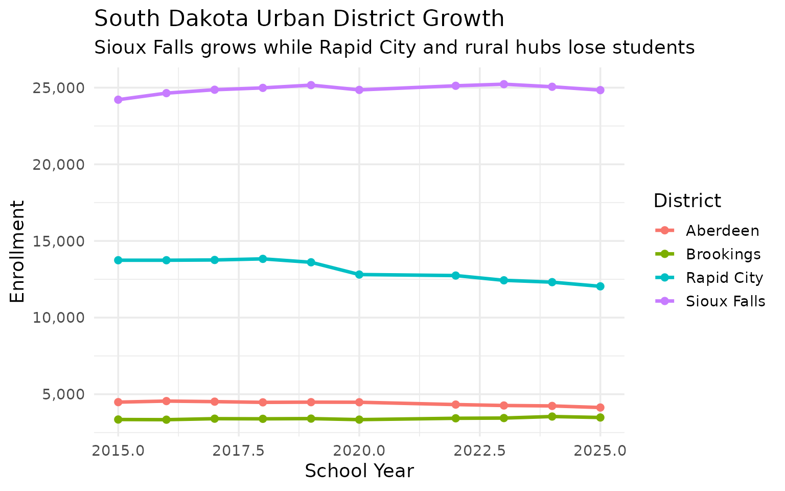

------------------------------------------------------------------------

## 5. Many tiny rural districts

South Dakota has a large number of very small school districts, many
with fewer than 200 students, reflecting the state’s rural character and
sparse population.

``` r
small <- enr_2025 |>
  filter(is_district, subgroup == "total_enrollment", grade_level == "TOTAL") |>
  filter(n_students < 200) |>
  arrange(n_students) |>
  head(15) |>
  select(district_name, n_students)

stopifnot(nrow(small) > 0)
small
#>         district_name n_students
#> 1   Elk Mountain 16-2         20
#> 2         Bowdle 22-1         45
#> 3  South Central 26-5         52
#> 4          Hoven 53-2        101
#> 5       Edgemont 23-1        106
#> 6       Oelrichs 23-3        117
#> 7          Bison 52-1        118
#> 8     White Lake 01-3        122
#> 9       McIntosh 15-1        141
#> 10        Doland 56-2        146
#> 11        Colome 59-3        153
#> 12       Herreid 10-1        153
#> 13         Henry 14-2        154
#> 14       Wakpala 15-3        159
#> 15 Tripp-Delmont 33-5        160
```

------------------------------------------------------------------------

## 6. Hispanic enrollment is rising fast

Hispanic students are the fastest-growing demographic group in South
Dakota schools, climbing from 7.97% to 9.25% of statewide enrollment in
just four years (2022-2025). Campus-level demographic data is available
starting in 2022.

``` r
hispanic_years <- c(2022:2025)
enr_hispanic <- fetch_enr_multi(hispanic_years, use_cache = TRUE)

hispanic_trend <- enr_hispanic |>
  filter(is_campus, subgroup == "hispanic", grade_level == "TOTAL") |>
  group_by(end_year) |>
  summarize(n_students = sum(n_students, na.rm = TRUE), .groups = "drop")

state_totals_hisp <- enr_hispanic |>
  filter(is_state, subgroup == "total_enrollment", grade_level == "TOTAL") |>
  select(end_year, total = n_students)

hispanic_trend <- hispanic_trend |>
  left_join(state_totals_hisp, by = "end_year") |>
  mutate(pct = round(n_students / total * 100, 2)) |>
  select(end_year, n_students, pct)

stopifnot(nrow(hispanic_trend) > 0)
hispanic_trend
#> # A tibble: 4 × 3
#>   end_year n_students   pct
#>      <int>      <dbl> <dbl>
#> 1     2022      11265  7.97
#> 2     2023      11983  8.5 
#> 3     2024      12751  9.07
#> 4     2025      12845  9.25
```

``` r
ggplot(hispanic_trend, aes(x = end_year, y = n_students)) +
  geom_line(linewidth = 1.2, color = "#2E8B57") +
  geom_point(size = 3, color = "#2E8B57") +
  geom_text(aes(label = paste0(pct, "%")), vjust = -1.5) +
  scale_y_continuous(labels = scales::comma, expand = expansion(mult = c(0, 0.15))) +
  labs(
    title = "Hispanic Student Enrollment Growth (2022-2025)",
    subtitle = "Fastest-growing demographic group in South Dakota",
    x = "School Year",
    y = "Number of Students"
  )
```

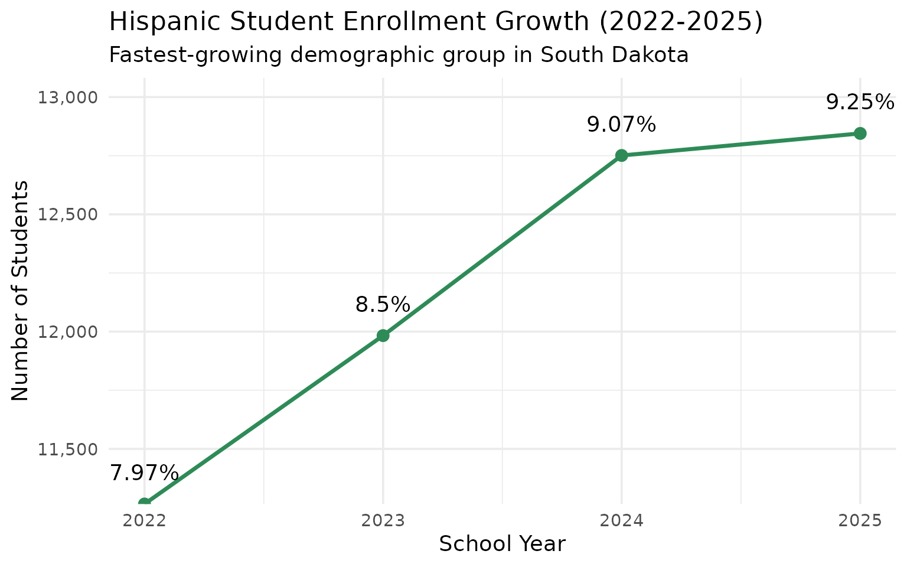

------------------------------------------------------------------------

## 7. Sioux Falls suburban growth outpaces the city

Harrisburg and Tea Area have seen explosive growth as Sioux Falls
suburbs boom, with Harrisburg more than doubling its enrollment from
2,724 to 6,398 students in just 15 years.

``` r
suburbs <- fetch_enr_multi(c(2011, 2015, 2020, 2025), use_cache = TRUE)

suburb_trend <- suburbs |>
  filter(is_district, subgroup == "total_enrollment", grade_level == "TOTAL",
         grepl("Harrisburg|Tea Area|Brandon Valley", district_name)) |>
  select(end_year, district_name, n_students)

stopifnot(nrow(suburb_trend) > 0)
suburb_trend
#>    end_year                 district_name n_students
#> 1      2011           Brandon Valley 49-2       3364
#> 2      2011               Harrisburg 41-2       2724
#> 3      2011 Tea Area School District 41-5       1383
#> 4      2015               Harrisburg 41-2       3900
#> 5      2015                 Tea Area 41-5       1610
#> 6      2015           Brandon Valley 49-2       3750
#> 7      2020           Brandon Valley 49-2       4682
#> 8      2020               Harrisburg 41-2       5449
#> 9      2020                 Tea Area 41-5       2045
#> 10     2025           Brandon Valley 49-2       5206
#> 11     2025               Harrisburg 41-2       6398
#> 12     2025                 Tea Area 41-5       2514
```

``` r
suburbs |>
  filter(is_district, subgroup == "total_enrollment", grade_level == "TOTAL",
         grepl("Harrisburg|Tea Area|Brandon Valley", district_name)) |>
  ggplot(aes(x = end_year, y = n_students, color = district_name)) +
  geom_vline(xintercept = 2020, linetype = "dashed", color = "gray50", alpha = 0.7) +
  geom_line(linewidth = 1.2) +
  geom_point(size = 3) +
  scale_y_continuous(labels = scales::comma) +
  scale_color_brewer(palette = "Set1") +
  labs(
    title = "Sioux Falls Suburban District Growth",
    subtitle = "Harrisburg, Tea Area, and Brandon Valley boom",
    x = "School Year",
    y = "Total Enrollment",
    color = "District"
  )
```

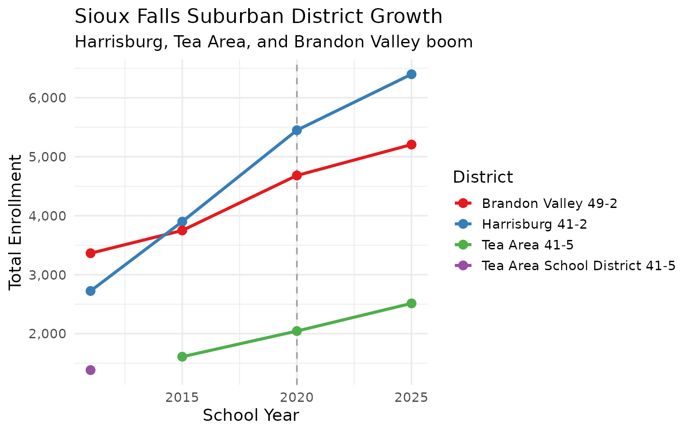

------------------------------------------------------------------------

## 8. Rapid City: West River anchor

Rapid City Area School District anchors western South Dakota, serving as
the only major urban district west of the Missouri River.

``` r
rapid <- fetch_enr_multi(c(2015:2020, 2022:2025), use_cache = TRUE)

rapid_trend <- rapid |>
  filter(is_district, grepl("Rapid City", district_name),
         subgroup == "total_enrollment", grade_level == "TOTAL") |>
  select(end_year, n_students)

stopifnot(nrow(rapid_trend) > 0)
rapid_trend
#>    end_year n_students
#> 1      2015      13743
#> 2      2016      13743
#> 3      2017      13760
#> 4      2018      13832
#> 5      2019      13609
#> 6      2020      12809
#> 7      2022      12743
#> 8      2023      12433
#> 9      2024      12313
#> 10     2025      12040
```

``` r
ggplot(rapid_trend, aes(x = end_year, y = n_students)) +
  geom_vline(xintercept = 2020, linetype = "dashed", color = "gray50", alpha = 0.7) +
  annotate("text", x = 2020, y = 15500, label = "COVID", hjust = -0.2, color = "gray50", size = 3) +
  geom_line(linewidth = 1.2, color = "#8B4513") +
  geom_point(size = 3, color = "#8B4513") +
  scale_y_continuous(labels = scales::comma, limits = c(12000, 16000)) +
  labs(
    title = "Rapid City Area School District Enrollment",
    subtitle = "Steady decline from 13,832 peak in 2018 to 12,040 in 2025",
    x = "School Year",
    y = "Total Enrollment"
  )
```

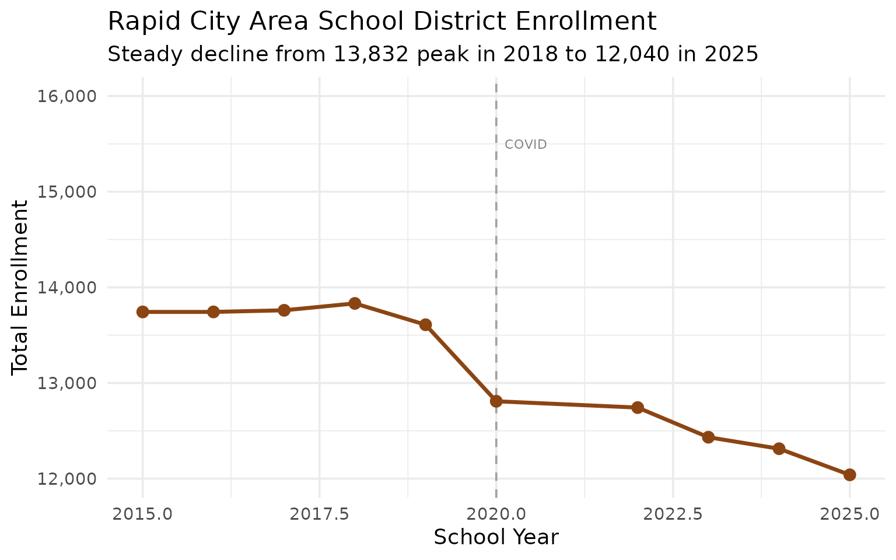

------------------------------------------------------------------------

## 9. Reservation schools: Todd County and Pine Ridge

Districts serving reservation communities face unique challenges. Todd
County (Rosebud) and Oglala Lakota County (Pine Ridge) serve
predominantly Native American students.

``` r
reservation <- fetch_enr_multi(c(2015, 2020, 2025), use_cache = TRUE)

res_data <- reservation |>
  filter(is_district,
         grepl("Todd County|Oglala Lakota|Shannon", district_name),
         subgroup == "total_enrollment",
         grade_level == "TOTAL")

stopifnot(nrow(res_data) > 0)
res_data
#>   end_year     type district_id campus_id             district_name campus_name
#> 1     2015 District       65001      <NA> Oglala Lakota County 65-1        <NA>
#> 2     2015 District       66001      <NA>          Todd County 66-1        <NA>
#> 3     2020 District       65001      <NA>        Oglala Lakota 65-1        <NA>
#> 4     2020 District       66001      <NA>          Todd County 66-1        <NA>
#> 5     2025 District       65001      <NA> Oglala Lakota County 65-1        <NA>
#> 6     2025 District       66001      <NA>          Todd County 66-1        <NA>
#>   grade_level         subgroup n_students pct is_state is_district is_campus
#> 1       TOTAL total_enrollment       1532   1    FALSE        TRUE     FALSE
#> 2       TOTAL total_enrollment       2013   1    FALSE        TRUE     FALSE
#> 3       TOTAL total_enrollment       1811   1    FALSE        TRUE     FALSE
#> 4       TOTAL total_enrollment       2156   1    FALSE        TRUE     FALSE
#> 5       TOTAL total_enrollment       1706   1    FALSE        TRUE     FALSE
#> 6       TOTAL total_enrollment       1956   1    FALSE        TRUE     FALSE
#>   aggregation_flag is_public district_type_code district_type_name
#> 1         district      TRUE               <NA>               <NA>
#> 2         district      TRUE               <NA>               <NA>
#> 3         district      TRUE               <NA>               <NA>
#> 4         district      TRUE               <NA>               <NA>
#> 5         district      TRUE                 10        10 – Public
#> 6         district      TRUE                 10        10 – Public
```

``` r
reservation |>
  filter(is_district,
         grepl("Todd County|Oglala Lakota", district_name),
         subgroup == "total_enrollment",
         grade_level == "TOTAL") |>
  ggplot(aes(x = end_year, y = n_students, fill = district_name)) +
  geom_col(position = "dodge") +
  scale_fill_brewer(palette = "Set2") +
  labs(
    title = "Reservation School District Enrollment",
    subtitle = "Todd County (Rosebud) and Oglala Lakota County (Pine Ridge)",
    x = "School Year",
    y = "Enrollment",
    fill = "District"
  )
```

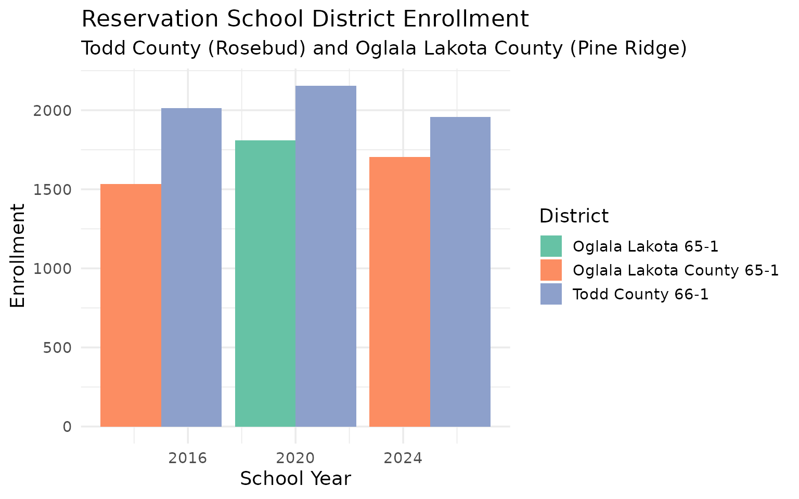

------------------------------------------------------------------------

## 10. Rural consolidation pressure

Many of South Dakota’s smallest districts face consolidation pressure.
Districts with fewer than 100 students struggle with economies of scale.

``` r
tiny <- fetch_enr(2025, use_cache = TRUE)

tiny_districts <- tiny |>
  filter(is_district, subgroup == "total_enrollment", grade_level == "TOTAL",
         n_students < 100) |>
  arrange(n_students) |>
  head(20) |>
  select(district_name, n_students)

stopifnot(nrow(tiny_districts) > 0)
tiny_districts
#>        district_name n_students
#> 1  Elk Mountain 16-2         20
#> 2        Bowdle 22-1         45
#> 3 South Central 26-5         52
```

``` r
size_dist <- fetch_enr(2025, use_cache = TRUE) |>
  filter(is_district, subgroup == "total_enrollment", grade_level == "TOTAL") |>
  mutate(size_category = cut(n_students,
                              breaks = c(0, 100, 250, 500, 1000, 5000, Inf),
                              labels = c("<100", "100-249", "250-499", "500-999", "1000-4999", "5000+"))) |>
  count(size_category)

stopifnot(nrow(size_dist) > 0)

ggplot(size_dist, aes(x = size_category, y = n, fill = size_category)) +
  geom_col(show.legend = FALSE) +
  geom_text(aes(label = n), vjust = -0.5) +
  scale_fill_viridis_d(option = "C") +
  labs(
    title = "South Dakota Districts by Enrollment Size",
    subtitle = "Many tiny districts face consolidation pressure",
    x = "District Size",
    y = "Number of Districts"
  )
```

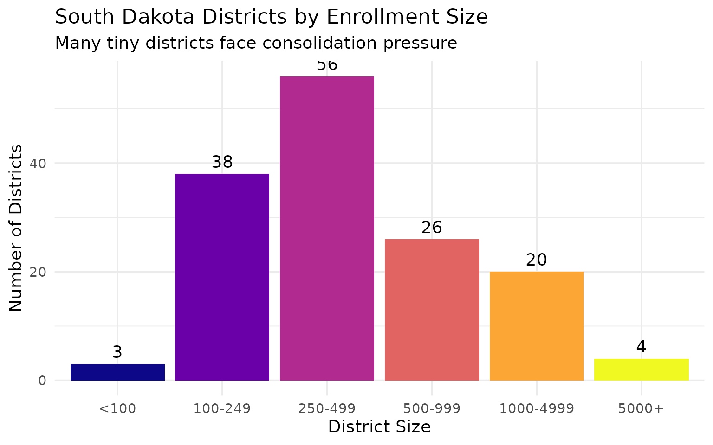

------------------------------------------------------------------------

## 11. High school enrollment surging while elementary stays flat

South Dakota’s high school enrollment grew 12% from 2015 to 2025, while
K-8 enrollment stayed essentially flat. This reflects larger birth
cohorts aging into upper grades.

``` r
hs_elem <- enr |>
  filter(is_state, subgroup == "total_enrollment",
         grade_level %in% c("K", paste0("0", 1:8), "09", "10", "11", "12")) |>
  mutate(level = ifelse(grade_level %in% c("09", "10", "11", "12"), "High School", "K-8")) |>
  group_by(end_year, level) |>
  summarize(n_students = sum(n_students, na.rm = TRUE), .groups = "drop")

stopifnot(nrow(hs_elem) > 0)
hs_elem
#> # A tibble: 20 × 3
#>    end_year level       n_students
#>       <int> <chr>            <dbl>
#>  1     2015 High School      37100
#>  2     2015 K-8              93836
#>  3     2016 High School      37306
#>  4     2016 K-8              95214
#>  5     2017 High School      37625
#>  6     2017 K-8              96236
#>  7     2018 High School      37972
#>  8     2018 K-8              97021
#>  9     2019 High School      38825
#> 10     2019 K-8              97308
#> 11     2020 High School      40303
#> 12     2020 K-8              95681
#> 13     2022 High School      41804
#> 14     2022 K-8              96271
#> 15     2023 High School      42063
#> 16     2023 K-8              95696
#> 17     2024 High School      42133
#> 18     2024 K-8              95180
#> 19     2025 High School      41507
#> 20     2025 K-8              94070
```

``` r
ggplot(hs_elem, aes(x = end_year, y = n_students, color = level)) +
  geom_vline(xintercept = 2020, linetype = "dashed", color = "gray50", alpha = 0.7) +
  geom_line(linewidth = 1.2) +
  geom_point(size = 2) +
  scale_y_continuous(labels = scales::comma) +
  scale_color_manual(values = c("High School" = "#E7298A", "K-8" = "#1B9E77")) +
  labs(
    title = "K-8 vs High School Enrollment (2015-2025)",
    subtitle = "High school enrollment grew 12% while K-8 stayed flat",
    x = "School Year",
    y = "Enrollment",
    color = "Level"
  )
```

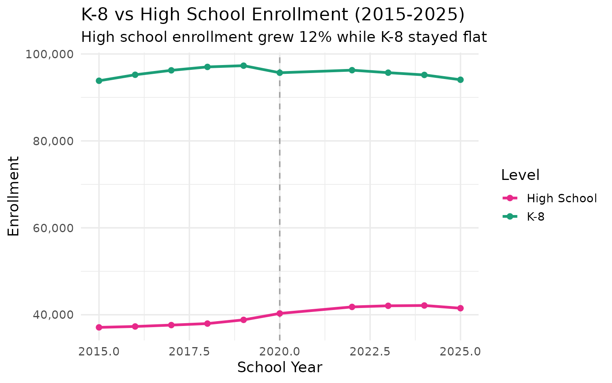

------------------------------------------------------------------------

## 12. The Black Hills corridor

The Black Hills region forms a distinct educational corridor, with Rapid
City at its center and smaller communities like Spearfish, Custer, and
Belle Fourche serving surrounding areas.

``` r
black_hills <- fetch_enr(2025, use_cache = TRUE)

bh_districts <- black_hills |>
  filter(is_district, subgroup == "total_enrollment", grade_level == "TOTAL",
         grepl("Rapid City|Spearfish|Sturgis|Custer|Lead|Deadwood|Belle Fourche", district_name)) |>
  arrange(desc(n_students)) |>
  select(district_name, n_students)

stopifnot(nrow(bh_districts) > 0)
bh_districts
#>          district_name n_students
#> 1 Rapid City Area 51-4      12040
#> 2       Spearfish 40-2       2301
#> 3   Belle Fourche 09-1       1241
#> 4          Custer 16-1        854
#> 5   Lead-Deadwood 40-1        590
```

``` r
fetch_enr(2025, use_cache = TRUE) |>
  filter(is_district, subgroup == "total_enrollment", grade_level == "TOTAL",
         grepl("Rapid City|Spearfish|Sturgis|Custer|Lead|Belle Fourche", district_name)) |>
  mutate(district_name = forcats::fct_reorder(district_name, n_students)) |>
  ggplot(aes(x = n_students, y = district_name, fill = district_name)) +
  geom_col(show.legend = FALSE) +
  scale_x_continuous(labels = scales::comma) +
  scale_fill_viridis_d(option = "D") +
  labs(
    title = "Black Hills Corridor School Districts",
    subtitle = "Rapid City dominates western South Dakota",
    x = "Total Enrollment",
    y = NULL
  )
```

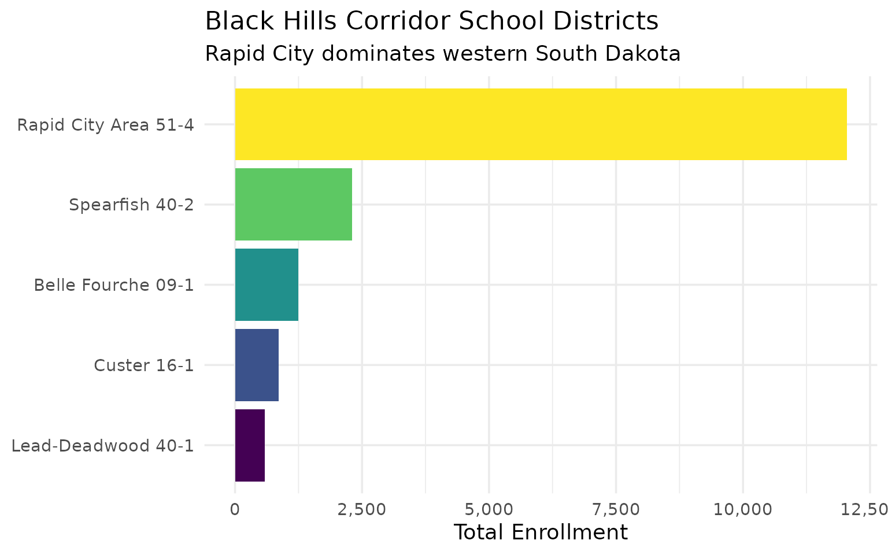

------------------------------------------------------------------------

## 13. Aberdeen and the northeast

Aberdeen School District anchors the northeast, with surrounding
agricultural communities feeding into regional schools.

``` r
northeast <- fetch_enr_multi(c(2015:2020, 2022:2025), use_cache = TRUE)

ne_trend <- northeast |>
  filter(is_district, grepl("Aberdeen", district_name),
         subgroup == "total_enrollment", grade_level == "TOTAL") |>
  select(end_year, n_students)

stopifnot(nrow(ne_trend) > 0)
ne_trend
#>    end_year n_students
#> 1      2015       4485
#> 2      2016       4554
#> 3      2017       4517
#> 4      2018       4471
#> 5      2019       4483
#> 6      2020       4477
#> 7      2022       4326
#> 8      2023       4265
#> 9      2024       4237
#> 10     2025       4134
```

``` r
fetch_enr_multi(c(2015:2020, 2022:2025), use_cache = TRUE) |>
  filter(is_district,
         grepl("Aberdeen|Watertown|Huron|Mitchell", district_name),
         subgroup == "total_enrollment", grade_level == "TOTAL") |>
  ggplot(aes(x = end_year, y = n_students, color = district_name)) +
  geom_vline(xintercept = 2020, linetype = "dashed", color = "gray50", alpha = 0.7) +
  geom_line(linewidth = 1.2) +
  geom_point(size = 2) +
  scale_y_continuous(labels = scales::comma) +
  scale_color_brewer(palette = "Dark2") +
  labs(
    title = "Regional Hub Districts: East River",
    subtitle = "Aberdeen, Watertown, Huron, and Mitchell anchor their regions",
    x = "School Year",
    y = "Enrollment",
    color = "District"
  )
```

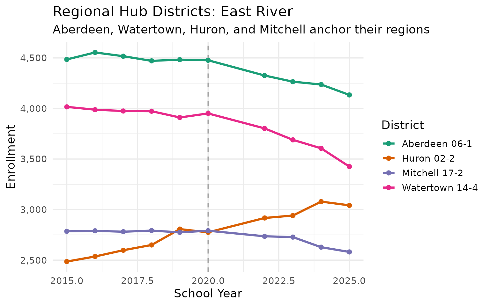

------------------------------------------------------------------------

## 14. Pre-K enrollment patterns

Pre-kindergarten enrollment varies significantly across districts,
reflecting different local policies and access to early childhood
programs.

``` r
prek <- fetch_enr(2025, use_cache = TRUE)

prek_data <- prek |>
  filter(is_district, subgroup == "total_enrollment", grade_level == "PK") |>
  filter(n_students > 0) |>
  arrange(desc(n_students)) |>
  head(15) |>
  select(district_name, n_students)

stopifnot(nrow(prek_data) > 0)
prek_data
#>                district_name n_students
#> 1           Sioux Falls 49-5        791
#> 2               Yankton 63-3        196
#> 3       Rapid City Area 51-4        165
#> 4      Wagner Community 11-4        105
#> 5  Oglala Lakota County 65-1         79
#> 6                Lennox 41-4         59
#> 7             Watertown 14-4         59
#> 8                Hamlin 28-3         55
#> 9               Douglas 51-1         53
#> 10       Brandon Valley 49-2         51
#> 11           Harrisburg 41-2         43
#> 12       McCook Central 43-7         43
#> 13            Brookings 05-1         40
#> 14      Alcester-Hudson 61-1         37
#> 15            Garretson 49-4         36
```

``` r
prek_chart_data <- fetch_enr(2025, use_cache = TRUE) |>
  filter(is_district, subgroup == "total_enrollment", grade_level == "PK") |>
  filter(n_students > 0) |>
  arrange(desc(n_students)) |>
  head(10) |>
  mutate(district_name = forcats::fct_reorder(district_name, n_students))

stopifnot(nrow(prek_chart_data) > 0)

ggplot(prek_chart_data, aes(x = n_students, y = district_name)) +
  geom_col(fill = "#9467BD") +
  scale_x_continuous(labels = scales::comma) +
  labs(
    title = "Top 10 Districts by Pre-K Enrollment",
    subtitle = "Urban districts lead in early childhood programs",
    x = "Pre-K Students",
    y = NULL
  )
```

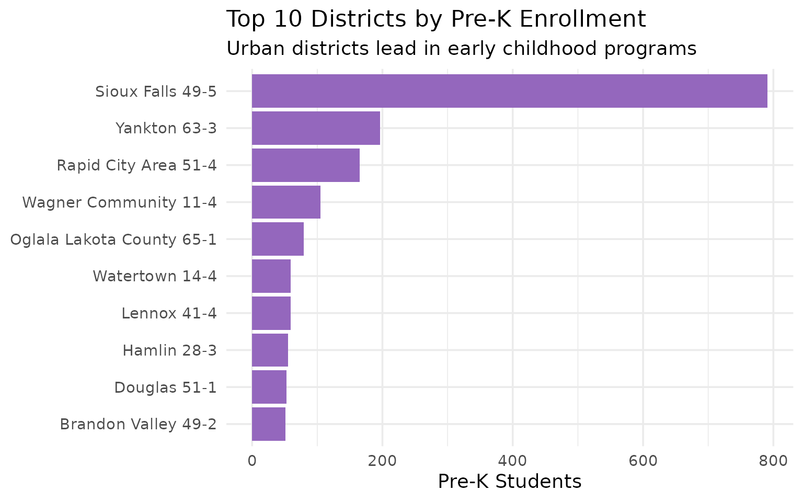

------------------------------------------------------------------------

## 15. Multiracial students: South Dakota’s growing diversity

Multiracial students grew from 8,129 (5.75%) to 8,681 (6.25%) of
statewide enrollment between 2022 and 2025, reflecting changing family
patterns statewide. Campus-level demographic data is available starting
in 2022.

``` r
multi <- fetch_enr_multi(c(2022, 2023, 2024, 2025), use_cache = TRUE)

multi_trend <- multi |>
  filter(is_campus, subgroup == "multiracial", grade_level == "TOTAL") |>
  group_by(end_year) |>
  summarize(n_students = sum(n_students, na.rm = TRUE), .groups = "drop")

state_totals_multi <- multi |>
  filter(is_state, subgroup == "total_enrollment", grade_level == "TOTAL") |>
  select(end_year, total = n_students)

multi_trend <- multi_trend |>
  left_join(state_totals_multi, by = "end_year") |>
  mutate(pct = round(n_students / total * 100, 2)) |>
  select(end_year, n_students, pct)

stopifnot(nrow(multi_trend) > 0)
multi_trend
#> # A tibble: 4 × 3
#>   end_year n_students   pct
#>      <int>      <dbl> <dbl>
#> 1     2022       8129  5.75
#> 2     2023       8370  5.94
#> 3     2024       8576  6.1 
#> 4     2025       8681  6.25
```

``` r
ggplot(multi_trend, aes(x = end_year, y = n_students)) +
  geom_col(fill = "#17BECF", width = 0.7) +
  geom_text(aes(label = scales::comma(n_students)), vjust = -0.5) +
  scale_y_continuous(labels = scales::comma, expand = expansion(mult = c(0, 0.15))) +
  labs(
    title = "Multiracial Student Enrollment Growth (2022-2025)",
    subtitle = "Growing share of South Dakota's student population",
    x = "School Year",
    y = "Number of Students"
  )
```

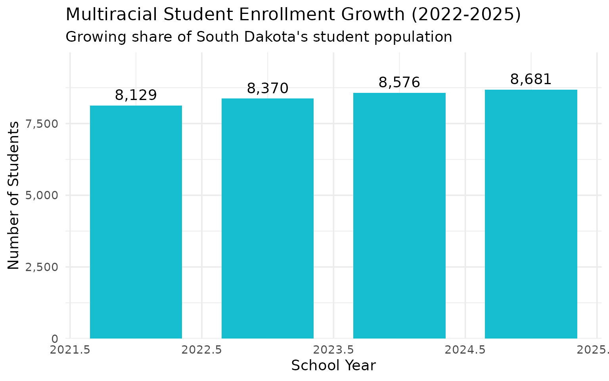

------------------------------------------------------------------------

## Summary

South Dakota’s school enrollment data reveals:

- **Post-peak decline**: Enrollment peaked at 141,429 in 2022 and is now
  dropping
- **Urban concentration**: Sioux Falls and Rapid City dominate
  enrollment
- **Native American presence**: Significant Native American student
  population
- **Suburban boom**: Harrisburg and Tea Area growing rapidly
- **Reservation challenges**: Todd and Oglala Lakota counties serve
  unique populations
- **Rural struggles**: Many tiny districts face consolidation pressure
- **Demographic change**: Hispanic and multiracial enrollment growing
  steadily
- **High school surge**: HS enrollment grew 12% while K-8 stayed flat
- **Regional hubs**: Black Hills and northeast districts anchor their
  regions
- **Early childhood**: Pre-K access varies significantly across
  districts

These trends have implications for school funding, facility planning,
and educational equity across the Mount Rushmore State.

------------------------------------------------------------------------

*Data sourced from the South Dakota Department of Education [Fall
Census](https://doe.sd.gov/ofm/enrollment.aspx).*

------------------------------------------------------------------------

## Session Info

``` r
sessionInfo()
#> R version 4.5.2 (2025-10-31)
#> Platform: x86_64-pc-linux-gnu
#> Running under: Ubuntu 24.04.3 LTS
#> 
#> Matrix products: default
#> BLAS:   /usr/lib/x86_64-linux-gnu/openblas-pthread/libblas.so.3 
#> LAPACK: /usr/lib/x86_64-linux-gnu/openblas-pthread/libopenblasp-r0.3.26.so;  LAPACK version 3.12.0
#> 
#> locale:
#>  [1] LC_CTYPE=C.UTF-8       LC_NUMERIC=C           LC_TIME=C.UTF-8       
#>  [4] LC_COLLATE=C.UTF-8     LC_MONETARY=C.UTF-8    LC_MESSAGES=C.UTF-8   
#>  [7] LC_PAPER=C.UTF-8       LC_NAME=C              LC_ADDRESS=C          
#> [10] LC_TELEPHONE=C         LC_MEASUREMENT=C.UTF-8 LC_IDENTIFICATION=C   
#> 
#> time zone: UTC
#> tzcode source: system (glibc)
#> 
#> attached base packages:
#> [1] stats     graphics  grDevices utils     datasets  methods   base     
#> 
#> other attached packages:
#> [1] ggplot2_4.0.2      tidyr_1.3.2        dplyr_1.2.0        sdschooldata_0.1.0
#> 
#> loaded via a namespace (and not attached):
#>  [1] gtable_0.3.6       jsonlite_2.0.0     compiler_4.5.2     tidyselect_1.2.1  
#>  [5] jquerylib_0.1.4    systemfonts_1.3.1  scales_1.4.0       textshaping_1.0.4 
#>  [9] readxl_1.4.5       yaml_2.3.12        fastmap_1.2.0      R6_2.6.1          
#> [13] labeling_0.4.3     generics_0.1.4     curl_7.0.0         knitr_1.51        
#> [17] forcats_1.0.1      tibble_3.3.1       desc_1.4.3         bslib_0.10.0      
#> [21] pillar_1.11.1      RColorBrewer_1.1-3 rlang_1.1.7        utf8_1.2.6        
#> [25] cachem_1.1.0       xfun_0.56          S7_0.2.1           fs_1.6.6          
#> [29] sass_0.4.10        viridisLite_0.4.3  cli_3.6.5          withr_3.0.2       
#> [33] pkgdown_2.2.0      magrittr_2.0.4     digest_0.6.39      grid_4.5.2        
#> [37] rappdirs_0.3.4     lifecycle_1.0.5    vctrs_0.7.1        evaluate_1.0.5    
#> [41] glue_1.8.0         cellranger_1.1.0   farver_2.1.2       codetools_0.2-20  
#> [45] ragg_1.5.0         httr_1.4.8         rmarkdown_2.30     purrr_1.2.1       
#> [49] tools_4.5.2        pkgconfig_2.0.3    htmltools_0.5.9
```
